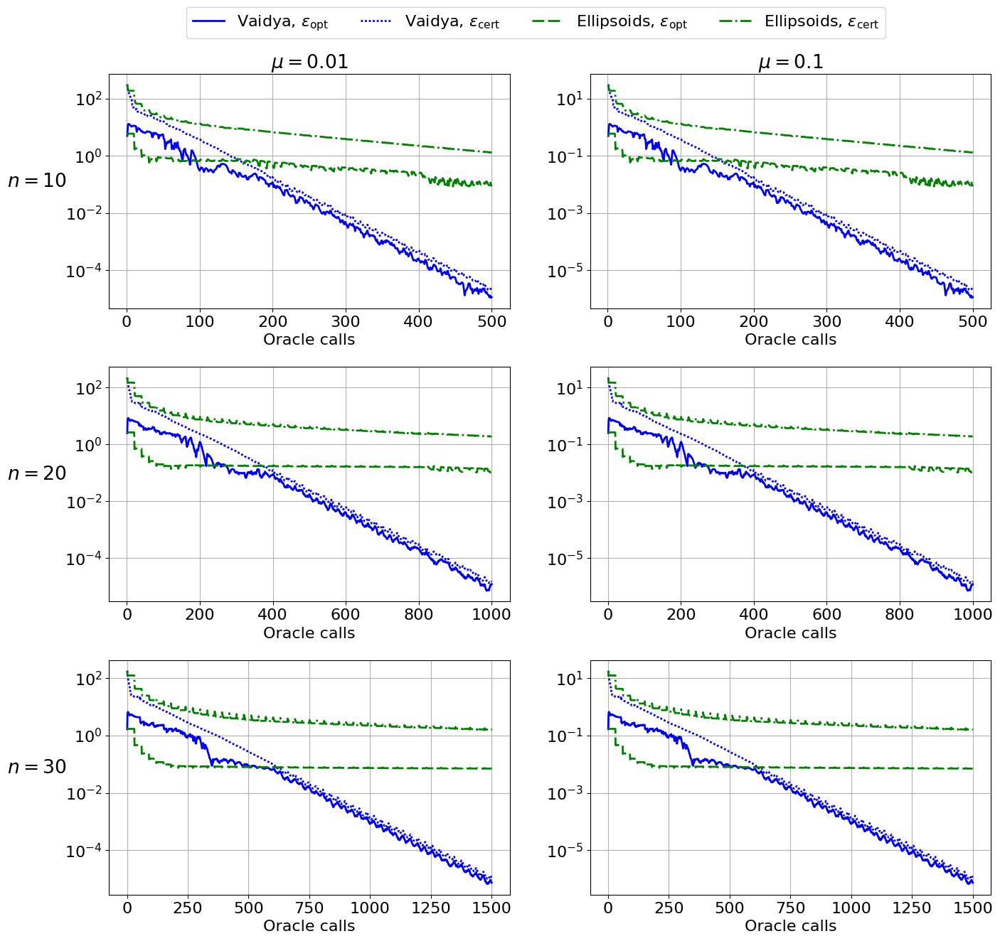

# Experiments for paper "Accuracy certificates for convex minimization with inexact oracle"
The results were obtained using Python 3.11.5 and the libraries listed in [requirements.txt](requirements.txt).
To install the libraries, run
```
pip install -r requirements.txt
```
To conduct the experiments, run
```
python experiments.py
```
As a result, the script will generate the image [Fig1.png](Fig1.png) which should look like this:

